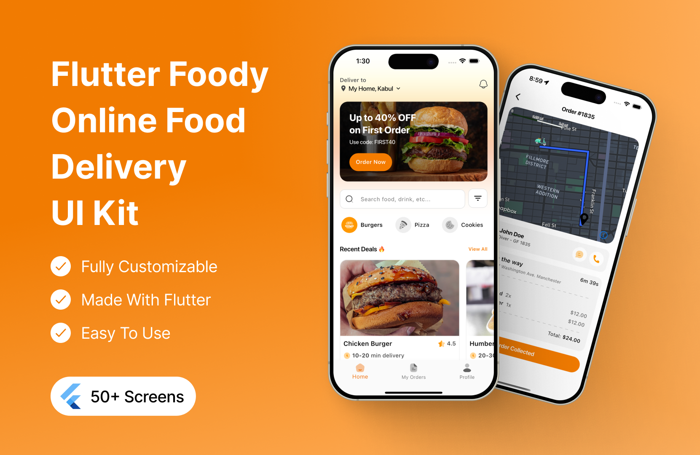
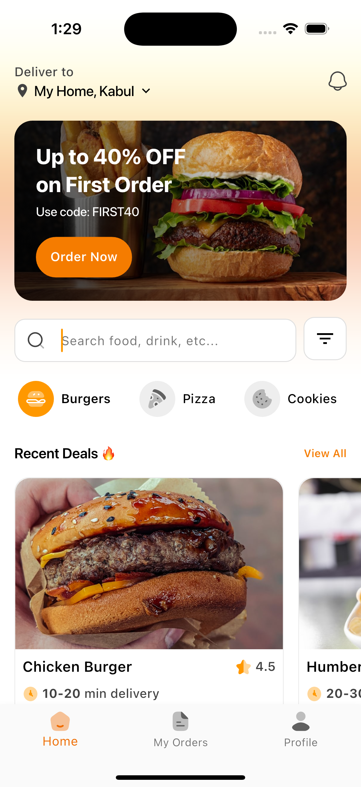
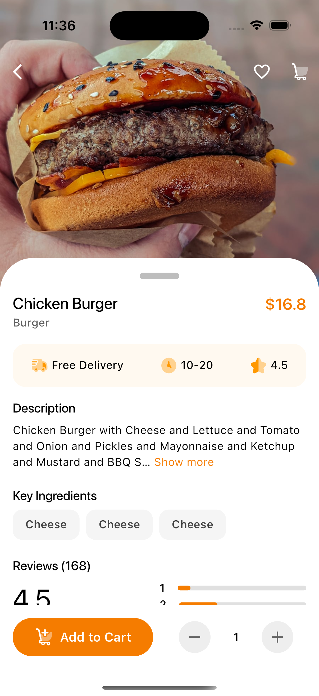
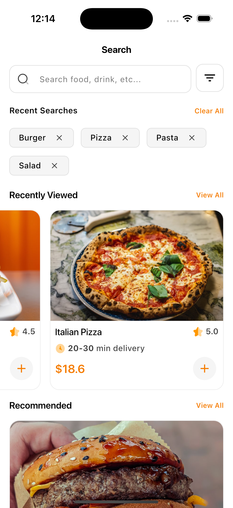
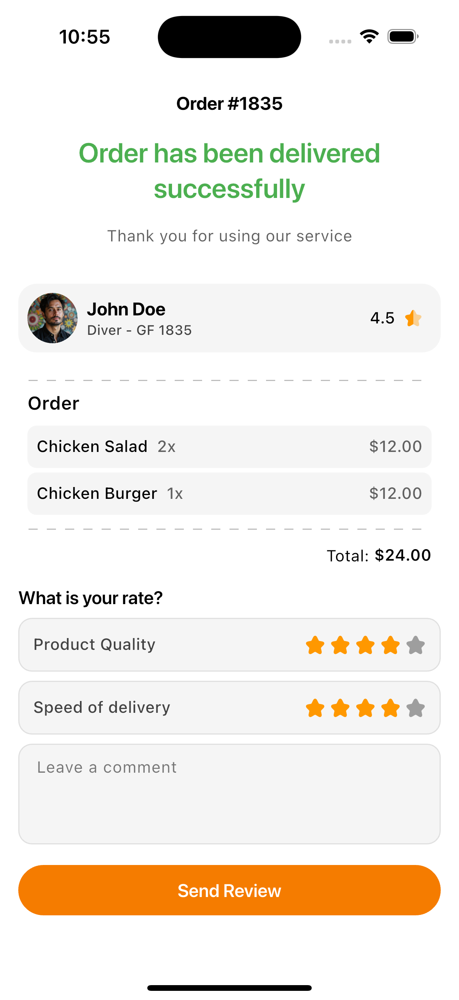
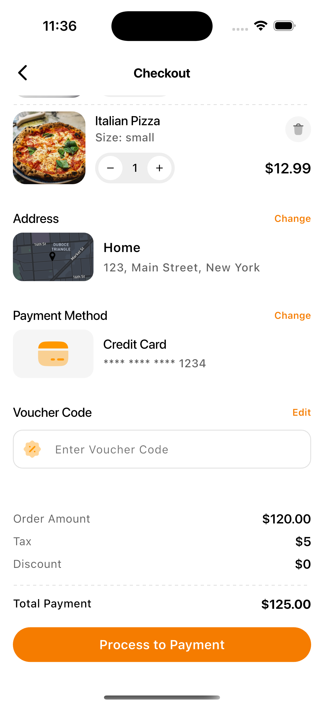

# Flutter Food Delivery Application UI Kit - Foody

> **🛒 How to Purchase**
>
> To get the full version of this UI kit with all features and screens, visit the [Foody UI Kit product page](https://afgprogrammer.com/ui-kits/flutter-online-food-delivery-application-ui-kit) and follow the purchase instructions. After purchase, you'll receive access to the complete source code and future updates.

A complete Flutter UI kit for a food delivery application, showcasing various screens and features. This project is designed to help developers quickly build a food delivery app using Flutter.

## Features
- Beautiful and modern UI design
- Multiple screens including home, product details, cart, and more
- Responsive layout for different screen sizes
- Easy to customize and extend
- Built with Flutter and Dart
- Uses Mapbox for location services
- Clean and well-structured codebase
- Supports both Android and iOS platforms
- Easy navigation between screens
- Integration with popular packages like `animate_do`, `mapbox_maps_flutter`, and `go_router`
- Sample data for products and categories
- User authentication screens
- Cart and checkout functionality
- Profile management
- Order history and tracking
- Push notifications
- Search functionality
- Filter and sort options
- Social media login options
- Localization support
- User reviews and ratings

## Getting Started
To purchase the full version of this UI kit, please visit [Foody UI Kit](https://afgprogrammer.com/ui-kits/flutter-online-food-delivery-application-ui-kit).

1. Clone this repository.
2. Run `flutter pub get` to install dependencies.
3. Replace `YOUR_MAPBOX_ACCESS_TOKEN` in the code with your own Mapbox token.
4. Run `flutter run` to launch on your device or simulator.

## Screenshots

 | Page | Page
|---|---|
|  |  |
|  |  |
|  |

## Live Demo
[Live Demo](https://afgprogrammer.com/ui-kits/flutter-online-food-delivery-application-ui-kit)

---
# Flutter-food-delivery-ui-kit
